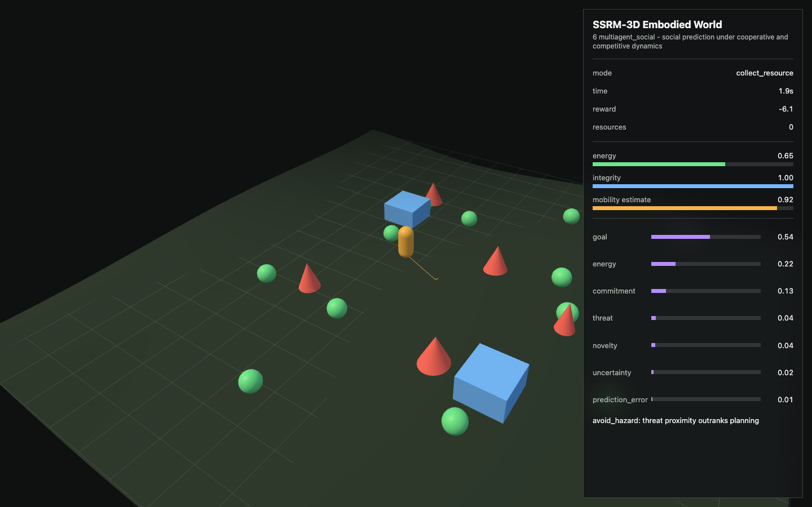
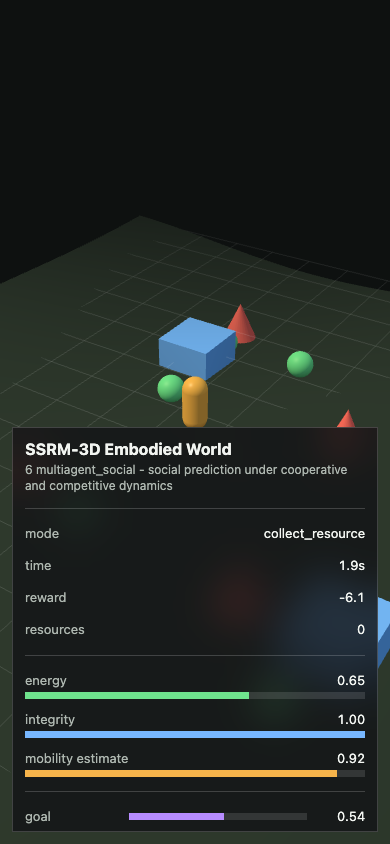
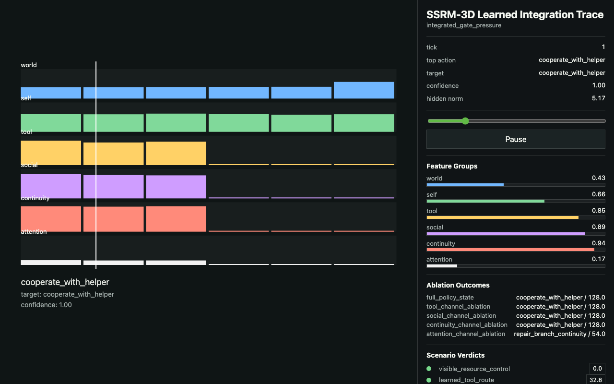

# Why Does a Self Exist?

A plain-language guide to the current research program.

## The One-Sentence Idea

> A self-like model becomes useful when an agent must keep acting over time while its own body, memory, needs, tools, relationships, commitments, skills, or control abilities are changing.

That is the project in plain English.

The repo is not trying to prove that the agents are conscious. It is asking a smaller and testable question:

> What breaks when an artificial agent cannot represent itself as the continuing system that is acting?

## What This Project Is

This is a falsifiable research program about selfhood as a control problem.

It treats "self" as a persistent model of the acting system. That model can be explicit, learned, distributed, or compressed inside recurrent policy state. It does not need to be a human-like ego.

The current public status:

- reports now include Report `127`, with roadmap docs through `102`;
- the canonical runner is wired for `107` executable runs;
- the newest evidence step is a negative sequence-value recovery boundary: completed-window value labels train with `0.701` pairwise accuracy, but held-out crisis score falls to `0.003`, below Report 126's `0.028`;
- a separate live open-emergence sandbox now explores larger geography, multiple shelters, generic physical action primitives, lifecycle cost, abstract reproduction, dependent care, private beliefs, environment-inferred symbol categories, influence-weighted symbol adoption, invented sound tokens, terrain glyphs, conflict, discovered specializations, shifting resource reliability, stale-map pressure, disease strain, social inequality, and a long-horizon development phase before delayed major shocks;
- the broader direction is an [accelerated agency and civilization testbed](agency_civilization_testbed.md), where the goal is to study what agents reliably reinvent under pressure;
- the long-term product/research direction is [simulation-distilled reasoning for LLMs](sim_distilled_reasoning_controller.md), where simulation-trained critics guide LLM planning instead of replacing the LLM;
- the most direct commercial path is [software field-experience controllers](software_field_experience_controller.md), where consequence-trained critics improve LLM coding agents on root-cause repair, tests, regressions, and review;
- the strongest result is still bounded simulation evidence;
- the project has useful evidence, but not a finished proof of a general selfhood law.

## What This Project Is Not

It is not a consciousness detector.

It is not a claim that the agents feel anything.

It is not a claim that language creates the self.

It is not a claim that any hidden variable is selfhood.

It is not a finished proof that selfhood naturally emerges in all adaptive systems.

The honest claim is narrower:

> In toy environments, persistent self-like state becomes useful when hidden agent-state is action-mediated, value-relevant, persistent, and reused across prediction or control.

## The Simple Version

A thermostat does not need a self. It can read temperature and turn heat on or off.

An embodied agent in a changing world may need more than that. It may need to know:

- how much energy it has;
- whether it is damaged, tired, sick, exposed, or overloaded;
- what its sensors can currently see or hear;
- what its actions currently do;
- what it promised or started earlier;
- who it can trust;
- which tools, shelters, alarms, caches, and routes still work;
- whether a mistake came from the world changing or from itself changing.

In this project, "self" means that kind of persistent agent-state model.

## What Counts As Self-Like Here

A hidden variable does not count as selfhood just because it is hidden or internal.

It counts as self-like only when it is:

| Test | Plain meaning |
|---|---|
| Agent-bounded | It is about the system that is acting. |
| Persistent | It matters beyond the current moment. |
| Action-mediated | It changes what the system's actions do. |
| Value-relevant | It affects survival, reward, future options, or commitments. |
| Counterfactually active | If it changed, the right action would change. |
| Reused | The same state helps across more than one task or decision. |

That boundary matters. Weather, terrain, market conditions, or another agent's private state may be hidden and important. Those are world models, not self models.

Self-like state is the model of:

> What condition am I, the acting system, in, and what follows from that?

## The Main Finding So Far

The evidence points to one main pattern:

> Self-like state is optional in simple tasks, but becomes useful when future control depends on the agent's own changing state.

The project keeps finding the same pressure points:

| Pressure | Why it pushes toward self-state |
|---|---|
| Hidden actuator drift | The agent must know whether the world changed or its own control changed. |
| Energy and damage | Future options depend on internal viability. |
| Fatigue, illness, and exposure | Internal condition changes what is safe, urgent, or possible. |
| Interruption and restore | The agent must know which memories and commitments belong to this continuing run. |
| Goal formation | A goal must be feasible for the current agent, not just attractive in the abstract. |
| Arbitration | Competing needs need a shared estimate of the same agent's state. |
| Tools and shelter | External aids matter only if the agent remembers their condition, location, and ownership. |
| Social trust | Promises, deception, help, reputation, and shared tools require identity and continuity memory. |
| Skill learning | Current ability affects what can be attempted now and what should be practiced later. |
| Dependent care | The agent must track another's fragile state while preserving its own viability. |
| Irreversible loss | Some actions permanently reduce future options, so caution and memory matter. |
| Affective control | Fear, stress, trust, curiosity, and guilt analogues can steer attention and risk without implying subjective feeling. |

## The Evidence Stack In Plain English

The repo is not one experiment. It is a ladder of tests.

| Layer | Reports | Plain question | Plain finding |
|---|---:|---|---|
| Research frame | [01-05](../01_research_brief.md) | Can the question be made testable instead of philosophical? | Yes: test whether agent-state improves prediction, control, adaptation, and continuity. |
| Minimal self/world tests | [06-12](../06_minimal_experiment_report.md) | Does self-state help when actions or internal viability change? | Yes in self-drift, energy, damage, and interruption settings; not in simple controls. |
| Learning and boundary tests | [13-24](../13_online_predictive_learning_report.md) | Can learned or reused state separate self from world? | Partly: learned filters and reuse sweeps recover self-like state when it is the reusable control variable. |
| Latent and attractor precursors | [25-36](../25_learned_bottleneck_discovery_report.md) | Can unlabeled learners discover reusable hidden structure? | Yes, but reusable hidden structure can be self or world; boundary tests are still required. |
| Recurrent and RL stress tests | [37-59](../37_horizon_pressure_sweep_report.md) | Do recurrent policies and actor-critics recover the boundary? | Sometimes strongly, sometimes partially. This is evidence, not a completed attractor law. |
| SSRM-3D embodied world | [60-64](../60_ssrm_3d_embodied_world_report.md) | Does the same idea survive in a persistent 3D-style agent world? | The 3D track supports the mechanism, while keeping language separate from the self. |
| Tools, society, and continuity | [65-73](../65_ssrm_3d_tool_making_report.md) | Do tools, trust, communication, restore, and integration pressure need self-state? | Candidate-policy tests are positive, but the no-leak learned-integration sweep is only partial. |
| Persistent pressure layers | [74-87](../74_ssrm_3d_persistent_pressure_layer_spec.md) | Which richer world pressures make self-state useful? | Perception, sleep, illness, weather, social contracts, threats, ecology, injury, development, care, loss, and affect all create testable self-state pressure. |
| Physics-first benchmark | [88](../88_ssrm_3d_physics_benchmark_report.md) | Can recurrent neural models learn from physics-derived streams without scenario labels? | Yes as offline recurrent decision learning; not yet as closed-loop deep reinforcement learning. |
| Settlement/civilization pressure | [89](../89_ssrm_3d_civilization_pressure_report.md) | What breaks when the world contains agents, roles, construction, norms, emotion-like control, and future shocks? | Integrated settlement state beats reactive individuals and targeted ablations, but this is still designed policy evidence. |
| Open-emergence sandbox | [sandbox](../90_ssrm_3d_open_emergence_sandbox.md) | What should a live non-replay demo expose before the next benchmark? | Agents start from traits and use generic primitives such as inspect, harvest, construct, repair, modify, strike, and signal. They carry private beliefs and thought traces, attach sounds/glyphs to environment-inferred categories, and can spread names through influence-weighted convention pressure. The current pass adds a 12-hour major-shock gate, slow ecology, shifting resource reliability, stale map knowledge, disease strain, social inequality, architecture/tool improvement, teaching tradition, risk memory, and operational wisdom/adaptation variables. It is not canonical evidence yet. |
| Long-horizon adaptation | [93](../93_ssrm_3d_long_horizon_adaptation_report.md) | Does the 12-hour development gate survive headless multi-seed verification? | Yes as a designed verifier: no major shocks before 12h, post-gate shock appears, agents survive, architecture/tools/teaching/risk memory improve, and targeted ablations create losses. It is not learned closed-loop evidence yet. |
| Multi-day maturation | [103](../103_ssrm_3d_multiday_maturation_report.md) | Can the development window extend into a multi-day world with births, tools, buildings, ecology, disease, and culture? | Yes as a designed verifier: the 72h world preserves the 12h shock gate, records births, improves architecture/tools, and shows targeted ablation losses. |
| Learned multi-day maturation | [104](../104_ssrm_3d_learned_multiday_maturation_controller_report.md) | Can a learned neural controller act closed-loop in that 72h world? | Partly: the GRU preserves the long-run development behavior and beats frame/reactive control, but social/culture, environment, and previous-action ablations are not clean. |
| Return-selected multi-day maturation | [105](../105_ssrm_3d_return_selected_multiday_maturation_controller_report.md) | Can closed-loop validation return select a better pressure-router setting? | Partly: validation chooses a `social_env` router and held-out worlds still mature, but social/culture and environmental ablations still do not reduce total score. |
| Coupled social/environment maturation | [106](../106_ssrm_3d_coupled_social_environment_maturation_report.md) | What if post-12h crises require environmental repair and social coordination together? | Current learned control fails: the designed controller resolves the coupled crises, but the learned return-selected GRU gets `0.000` crisis score and only `0.100` resolved rate. |
| Coupled crisis repair critic | [107](../107_ssrm_3d_coupled_crisis_repair_critic_report.md) | Can a learned repair critic fix that coupled-crisis failure? | No: validation selects repair bias `0.0`, so the critic is rejected and the learned controller still gets `0.000` crisis score. |
| Coupled crisis outcome value | [108](../108_ssrm_3d_coupled_crisis_outcome_value_report.md) | Can counterfactual action-value reranking fix coupled crises? | No: validation selects value bias `1.75`, but held-out crisis score stays `0.000` and the return-selected GRU does better. |
| Coupled crisis sequence outcome | [109](../109_ssrm_3d_coupled_crisis_sequence_outcome_report.md) | Can sequence-level plan control fix coupled crises? | Partly: crisis score rises to `0.304` and resolved rate to `0.500`, but environment ablation is still too weak for the strong claim. |
| Coupled crisis environmental bottleneck | [110](../110_ssrm_3d_coupled_crisis_environment_bottleneck_report.md) | What if generic environmental activity no longer counts as repair? | No: the stricter learned overlay improves resolved rate and coupled response over the return-selected GRU, but crisis score remains `0.000` and ablations still fail. |
| Coupled crisis rollout window | [111](../111_ssrm_3d_coupled_crisis_rollout_window_report.md) | What if the plan-value target comes from cloned simulator rollouts instead of an analytic utility? | No: validation rejects the rollout overlay by selecting plan bias `0.0`; held-out crisis score remains `0.000`, resolved rate stays `0.100`, and the coupled-crisis failure remains. |
| Coupled crisis diagnostic memory | [112](../112_ssrm_3d_coupled_crisis_diagnostic_memory_report.md) | What if a recurrent head learns the primary environmental repair action directly? | No: offline diagnostic accuracy reaches `0.991`, but validation selects diagnostic bias `0.0`; nonzero bias increases environmental response while zeroing social response and increasing damage. |
| Coupled crisis joint arbitration | [113](../113_ssrm_3d_coupled_crisis_joint_arbitration_report.md) | What if separate learned environmental and social action heads are coordinated together? | Yes as a bounded precursor: validation selects joint quotas, held-out crisis score rises from `0.000` to `0.380`, resolved rate rises from `0.100` to `0.650`, and social/environment ablations collapse coupled response. |
| Coupled crisis randomized transfer | [114](../114_ssrm_3d_coupled_crisis_randomized_transfer_report.md) | Does joint arbitration survive randomized post-12h crisis timing and initial pressure? | Yes as a bounded transfer precursor: 96h eval worlds average `5.8` post-gate crises; crisis score rises from `0.000` to `0.706`; resolved rate rises from `0.067` to `0.967`; social/environment ablations collapse coupled response. |
| Coupled crisis adaptive allocation | [115](../115_ssrm_3d_coupled_crisis_adaptive_allocator_report.md) | Can allocation between environmental and social repair be trained from closed-loop return instead of fixed quotas? | Partly: adaptive allocation improves crisis score from `0.000` to `0.224` vs return-selected and beats the fixed-joint baseline in this run, but fails the stronger non-fixed-transfer gate. |
| Coupled crisis policy/value allocation | [116](../116_ssrm_3d_coupled_crisis_policy_value_allocator_report.md) | Can a value model trained from allocator-policy consequences select better held-out allocators? | No, not yet: tune objective improves from `1.186` to `1.354`, but held-out crisis score falls to `0.224` versus `0.361` for the seed/fixed allocator. |
| Coupled crisis active state/action value | [117](../117_ssrm_3d_coupled_crisis_active_state_value_report.md) | Can active crisis state/action value labels improve held-out repair? | No: the value model trains on `120000` examples and validation selects bias `2.5`, but held-out crisis score stays `0.000` and total score `0.518` does not beat return-selected `0.520` or fixed-joint `0.604`. |
| Coupled crisis temporal return value | [118](../118_ssrm_3d_coupled_crisis_temporal_return_value_report.md) | Can delayed crisis-window outcome labels improve held-out repair? | No: the label signal is real, and resolved rate improves over return-selected from `0.033` to `0.280`, but crisis score stays `0.000` and fixed joint is far stronger. |
| Coupled crisis active policy | [119](../119_ssrm_3d_coupled_crisis_active_policy_report.md) | Can sampled policy-gradient updates inside crisis windows improve held-out repair? | Not enough: the policy trains over `73` crises and coupled response rises from `0.028` to `0.147`, but crisis score stays `0.000` and fixed joint remains far stronger. |
| Coupled crisis actor-critic | [120](../120_ssrm_3d_coupled_crisis_actor_critic_report.md) | Does adding a learned critic baseline make active crisis policy solve held-out crises? | No: the critic trains over `71` crises, but held-out crisis score, resolved rate, and coupled response all fall to `0.000`. |
| Coupled crisis memory policy | [121](../121_ssrm_3d_coupled_crisis_memory_policy_report.md) | Does recurrent hidden state across the crisis window fix active policy learning? | No: the policy trains across `90` crises, but held-out crisis score, resolved rate, and coupled response remain `0.000`. |
| Coupled crisis process policy | [122](../122_ssrm_3d_coupled_crisis_process_policy_report.md) | Does explicit two-channel process pressure make the learned policy keep environmental and social repair active together? | No: the policy trains across `91` crises, but held-out crisis score, resolved rate, and coupled response remain `0.000`; it collapses to social response without environmental repair. |
| Coupled crisis minimum-channel planner | [123](../123_ssrm_3d_coupled_crisis_min_channel_planner_report.md) | Can a dynamic weakest-channel planner around learned action heads preserve both repair channels? | Yes as a bounded structured-planning result: crisis score rises to `0.590`, resolved rate to `0.878`, and both social/environment ablations collapse the result. |
| Coupled crisis planner distillation | [124](../124_ssrm_3d_coupled_crisis_planner_distillation_report.md) | Can that successful planner be distilled into a learned recurrent policy and removed? | No, not yet: imitation accuracy reaches `0.986`, but held-out crisis score remains `0.000` and coupled response is only `0.179` versus `0.828` for the teacher planner. |
| Coupled crisis closed-loop recovery | [125](../125_ssrm_3d_coupled_crisis_closed_loop_recovery_report.md) | Does relabeling the learner's own off-trajectory crisis states make planner removal work? | No: the aggregate recovery set grows to `74756` examples, but held-out crisis score, resolved rate, and coupled response are all `0.000`. |
| Coupled crisis consequence recovery | [126](../126_ssrm_3d_coupled_crisis_consequence_recovery_report.md) | Does weighting training by completed crisis outcomes improve planner removal? | Partly: crisis score becomes `0.028`, resolved rate `0.356`, and coupled response `0.355`, but the teacher planner remains much stronger. |
| Coupled crisis sequence-value recovery | [127](../127_ssrm_3d_coupled_crisis_sequence_value_recovery_report.md) | Does a completed-window value critic improve consequence-policy actions after planner removal? | No: the critic trains with `0.701` pairwise accuracy, but held-out crisis score falls to `0.003`, below Report 126. |
| Coupled crisis counterfactual sequence recovery | [128](../128_ssrm_3d_coupled_crisis_counterfactual_sequence_recovery_report.md) | Does cloned-rollout multi-action window scoring improve consequence-policy repair? | Not yet: the plan scorer trains with weak signal, but validation selects plan bias `0.0`; crisis score reaches `0.036`, but the plan layer itself is rejected. |
| Hidden-regime adaptation | [94](../94_ssrm_3d_hidden_regime_adaptation_report.md) | Can the world change its hidden rules after 12h without handing agents a label? | Yes as a designed verifier: agents receive noisy symptoms, not regime names, and the integrated condition passes hidden water, weather, food, tool, and social regime pressure. Ablations expose inference, teaching, reputation/influence, sanitation, weather, and tool-adaptation losses. |
| Learned hidden-regime controller | [95](../95_ssrm_3d_learned_hidden_regime_controller_report.md) | Can a neural controller act closed-loop in that hidden-regime world? | Partly: the GRU learned controller acts in the world, preserves the 12h gate, survives hidden-regime activation, develops tools/infrastructure, transfers knowledge, and beats reactive control. It does not beat the frame model or pass clean ablation specificity. |
| Option-gated hidden-regime controller | [96](../96_ssrm_3d_option_gated_hidden_regime_controller_report.md) | Does a learned response-option head improve hidden-regime control? | Partly: GRU response improves, targeted response rises, and regime-signal removal now hurts. The frame model still wins and social/culture ablation remains unstable. |
| Return-selected hidden-regime controller | [97](../97_ssrm_3d_return_selected_hidden_regime_controller_report.md) | Can validation return select a better learned controller setting? | Yes as a bounded precursor: validation return chooses the option bias, the selected GRU beats fixed bias, frame, and reactive controls on held-out worlds, and regime-signal, infrastructure, and body ablations create losses. It is still not gradient deep RL. |
| Social/culture hidden-regime controller | [98](../98_ssrm_3d_social_culture_hidden_regime_controller_report.md) | Can the learned controller handle delayed hidden social/culture regimes? | Partly: the GRU strongly beats reactive control and only edges fixed-bias/frame controls across trust, symbol, coalition, teacher-loss, and rumor variants. The result remains partial because social/culture ablation is not clean across social response metrics. |
| Social credit-assignment controller | [99](../99_ssrm_3d_social_credit_assignment_controller_report.md) | Can the learned controller choose the right social repair when wrong repairs consume the recovery window? | No, not yet. The GRU beats reactive, frame, and fixed-bias controls in total score, but targeted repair is low, wrong repair is high, and social/culture ablation improves several repair metrics. This is a useful failed boundary. |
| Social repair critic controller | [101](../101_ssrm_3d_social_repair_critic_controller_report.md) | Can a learned repair critic improve the wrong-repair failure? | It improves the numbers but still fails the strong claim. Targeted repair rises from `0.287` to `0.402`, but social/culture ablation remains unstable and rumor correction still collapses. |

## What The Early Experiments Showed

The first experiments deliberately stay small.

They ask questions like:

- If the agent's actuator changes, can it tell that "I changed" rather than "the world changed"?
- If energy and damage affect future survival, does the agent need internal viability state?
- If memory is interrupted or corrupted, does identity metadata matter?
- If several subsystems want different actions, does shared self-state improve arbitration?
- If one hidden agent property matters across many tasks, does a shared estimate beat local probing?

The pattern is not "self-state always wins."

The pattern is:

> Self-state wins when the task actually makes the agent's own changing state matter.

That is important because it keeps the theory falsifiable.

## What The Learned Experiments Added

The later non-3D experiments remove some hand-holding.

They test learned bottlenecks, recurrent filters, raw reward histories, model-based planning, policy-gradient learners, and actor-critic controllers.

The useful result:

> Learned systems can recover self-relevant state under some pressure regimes.

The important limit:

> High task reward alone is not enough. A policy can perform well without necessarily discovering the self/world boundary we care about.

That is why the repo uses ablations and counterfactual edits. It is not enough to say "the agent did well." The evidence has to show that removing the self-like component causes the expected failure.

## SSRM-3D: The Embodied Toy World

SSRM-3D is the persistent embodied simulation track.

It gives the agent a world, position, orientation, hazards, resources, shelter, tools, attention, social state, continuity records, and action pressure.

The polished image below is a concept view of what the world is trying to test.

The screenshots below show the actual visualization style used by the current repo.

The point is not visual realism. The point is pressure realism: persistent conditions that change what the agent should do.

The current live sandbox goes one step further than replay: it runs browser-side agents with online neural action policies in a larger top-down world with multiple shelters, visually distinct resource regions, generic construct/repair/modify/strike primitives, private belief and thought traces, environment-inferred symbol categories, influence-weighted symbol adoption, invented sound tokens, persistent terrain glyphs, optional synthesized audio, abstract reproduction, dependent offspring, inherited reserve, recovery through shelter/treatment, aging, death pressure, shifting resource reliability, stale-map pressure, disease strain, social inequality, an adaptive-pressure ledger, and an overnight-scale development phase before delayed major shocks.

That sandbox is not a proof result. It is a public-facing prototype for the next serious closed-loop benchmark.

## The SSRM-3D Pressure Layers

The project added richer world pressure only when it creates a testable control problem.

The current pressure-layer stack includes:

| Layer | Plain-language role |
|---|---|
| Structured vision and spatial audio | The agent does not know everything globally; it perceives locally. |
| Day/night and sleep/rest | Rest restores capability but creates vulnerability. |
| Hunger, thirst, illness, and sanitation | Internal state has delayed consequences and ambiguous causes. |
| Weather and exposure | Shelter, planning, fire, water, and timing become useful. |
| Tool and shelter degradation | External memory and protection can wear out. |
| Social trust and contracts | Promises, reputation, and shared tools carry forward. |
| Predator and threat agents | Fear-like control, stealth, alarms, and social warning become useful. |
| Resource ecology | Restraint, caching, sharing, and territory matter over time. |
| Injury and disability adaptation | Capability changes, so goals and routes must adapt. |
| Development and skill learning | The agent has a changing competence profile. |
| Dependent care | Another fragile agent creates obligations and tradeoffs. |
| Irreversible loss | Some choices permanently reduce future options. |
| Affective control | Compact summaries like fear, stress, trust, curiosity, and guilt can alter attention and risk. |

## Pressure-Layer Gallery

These are visual summaries of the current SSRM-3D pressure reports.

## Physics-First Benchmark

Report 88 is different from the earlier pressure rows.

Report 88 adds a modular physics-first benchmark: a C++ simulation kernel generates terrain, weather, shelter, resources, illness/care pressure, sound, vibration, tension, FOV perception, and user proposals. Python trains recurrent neural models on those physics-derived streams without scenario labels.

That is real neural sequence learning, but it is not a claim that a live self-aware agent has been trained. The current model learns from traces. The next threshold is closed-loop learning, where the trained policy acts in the physics world, receives consequences, and fails under targeted ablations while acting.

## Settlement Pressure

Report 89 answers a visible weakness in the first physics replay: one agent moving between water and shelter is not enough to test society-scale pressure.

The settlement layer adds eight named agents, roles, construction projects, shared resources, social memory, norms, emotion-like control state, knowledge, map coverage, conflict, sickness, and late frontier shocks.

The integrated settlement policy reaches `0.812` mean civilization score. Reactive individuals fall to `0.502`, and removing norms, role memory, future planning, building memory, social memory, or affective control all causes targeted losses. This is still designed policy evidence, not open-ended civilization or proof of subjective experience.

## Language Is Not The Self

Language is treated as a slow reasoning layer, not as the self and not as the whole organism.

The language module can receive compressed state packets, reason about them, and suggest plans. The fast control system still owns perception, self-state, attention, arbitration, and action.

This keeps language testable:

- removing language should hurt slow planning and explanation more than reflex survival;
- corrupting self-state should hurt control even if language remains available;
- a language-only agent with no persistent self-state would weaken the architecture claim if it performed equally well.

The long-term LLM direction is not to make the LLM the agent. It is to distill simulation-trained judgment into critics that help an LLM search, rank, and repair plans. See [The Long-Term Use: Simulation-Distilled Reasoning For LLMs](sim_distilled_reasoning_controller.md).

The direct commercial version is software: use consequence-trained critics around coding agents so they choose better repairs, tests, and review decisions. See [The Commercial Path: Software Field-Experience Controllers](software_field_experience_controller.md).

## Attention, Emotion, And Control

The affective layer is not a claim about subjective feeling.

It models emotion-like states as control summaries:

- fear can raise threat attention and lower risk tolerance;
- stress can narrow attention under competing demands;
- trust can bias cooperation or help requests;
- frustration can trigger retries, tool switching, or help-seeking;
- curiosity can increase inspection when risk is tolerable;
- guilt-like state can prioritize repair after a broken commitment.

The question is not "does the agent feel fear?"

The question is:

> Does a fear-like control variable improve action under threat, and does removing it cause the expected failure?

## Learned Integration: Useful But Not Finished

The learned-integration work is one of the most important places to stay conservative.

Report 69 showed that a recurrent controller can use designed packets for tools, social memory, continuity, and attention.

Report 73 then made the test harder by removing scenario identity leakage and randomizing pressure combinations. That no-leak sweep produced a partial negative result:

- some social, continuity, tool, and integrated rows survived;
- the stronger no-leak integration claim did not fully hold;
- local tool margin and integrated social stability were not strong enough.

That does not erase the bridge result. It correctly downgrades it.

The honest status is:

> We have a useful designed packet bridge. We do not yet have strong autonomous learned integration.

## Public Talking Points

Use these as the clean public version of the project.

1. A self is not needed for every intelligent system.
2. A self-like model becomes useful when the agent's own changing state affects future action.
3. The project separates selfhood from consciousness.
4. The project separates language from selfhood.
5. Hidden-state tracking is not enough; the state must be agent-bounded and control-relevant.
6. The strongest evidence comes from ablations: remove the self-like state and the specific behavior should fail.
7. Tools and shelters matter because they externalize memory and preserve future options.
8. Social trust matters because promises, reputation, deception, and care require continuity.
9. Affective states can be modeled as control summaries without claiming subjective emotion.
10. Negative results are part of the research, not a problem to hide.
11. The current result is serious bounded-simulation evidence, not proof of a universal law.
12. The next frontier is closed-loop learned controllers in the physics world, not more hand-picked scenario rows.

## The Current Honest Finding

In plain English:

> A persistent self-like model looks useful when an agent has to survive, adapt, remember, repair, cooperate, and continue through changing conditions. The current evidence now includes physics-first recurrent learning and sharper learned social-control failures, but it still supports a mechanism, not a consciousness claim.

The most important open weakness:

> The project has not yet proven that selfhood naturally emerges in open learned agents. Some results still depend on designed scenarios, supplied candidate policies, or structured state packets.

That is why the next serious step is to close the loop: train learned controllers while acting in the physics world and test whether the same self-like variables are discovered without shortcuts.

## What Would Prove This Wrong?

The project should fail if better evidence shows that:

- no-self agents match performance in rich long-horizon pressure worlds;
- generic memory solves the same tasks without agent-bounded state;
- world-only models scale better than self-state models;
- self-like variables only appear when hand-coded;
- learned agents solve the tasks without stable, causally active agent-state;
- seed sweeps or architecture sweeps collapse the pattern;
- richer environments make local heuristics outperform persistent self-state.

Those are not footnotes. They are the falsifiers.

## How To Read The Repo

Start here:

- [Public findings article](research_article.md)
- [Current synthesis](../11_current_synthesis.md)
- [Evidence matrix](../12_evidence_matrix.md)
- [Repository weakness audit](../70_repo_weakness_audit.md)
- [Persistent pressure layer spec](../74_ssrm_3d_persistent_pressure_layer_spec.md)

For the technical stack, use the root [README](../../README.md).
