# Why Would an Artificial Agent Need a Self?

## Findings So Far From A Controlled Simulation Research Program

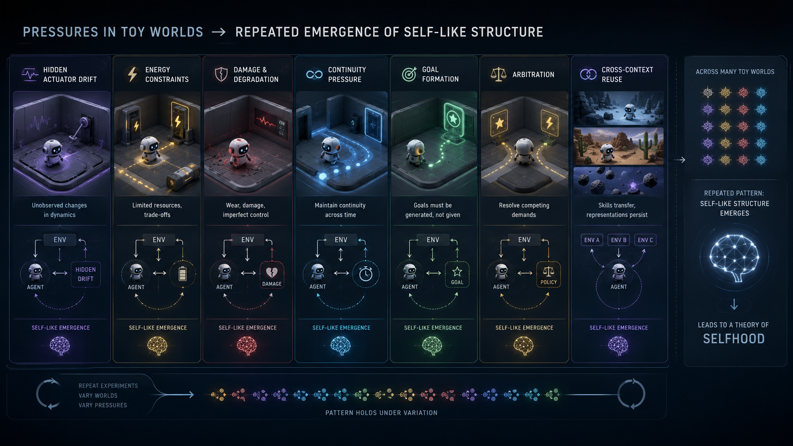

### Short Version

The current evidence suggests that a self-like model is not needed for every intelligent system.

It becomes useful when an agent must keep acting over time while its own body, memory, needs, tools, social commitments, and abilities are changing.

That is the core result:

> A self can be understood as a persistent control model of the system that is acting.

This is not a proof of consciousness. It is not a claim that the agents have inner experience. It is a falsifiable architecture claim about prediction, control, adaptation, and continuity.

## The Research Question

The project starts with one question:

> When does representing "me" become more useful than representing "the world only"?

Many systems can work without anything like a self. A thermostat reacts to temperature. A simple game bot follows rules. A planner can choose actions from a map.

But a long-running embodied agent faces a harder problem. Its own state changes:

- its sensors can become unreliable;
- its actions can stop having the same effect;
- its energy can fall;
- its tools can wear out;
- its memory can become stale;
- its promises can carry forward;
- its relationships can change;
- its skills can improve or degrade.

In that kind of setting, the agent needs to model not only the world, but also the continuing system that is acting inside the world.

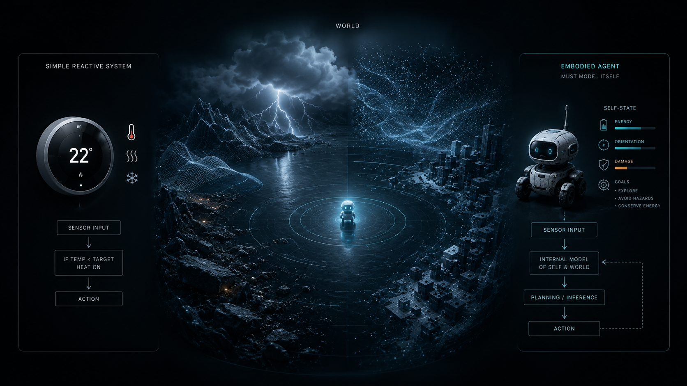

## What "Self" Means In This Project

The word "self" is easy to overuse, so the project defines it narrowly.

Here, a self-like state is:

> a persistent internal model of the acting system as a distinct entity through time.

That does not require a human-like ego. It does not require language. It does not require consciousness.

It does require more than generic hidden-state tracking. A hidden variable counts as self-like only if it is:

| Requirement | Plain meaning |
|---|---|
| Agent-bounded | It is about the system that is acting. |
| Persistent | It matters beyond the current instant. |
| Action-mediated | It changes what the system's actions do. |
| Control-relevant | It affects survival, reward, options, or commitments. |
| Counterfactually active | If the state changed, the right action would change. |
| Reused | The same state helps across multiple decisions or contexts. |

This boundary is important. Hidden weather is not selfhood. Hidden terrain is not selfhood. Another agent's private state is not selfhood. Those may be important world models.

Self-like state is the model of "what condition am I, the acting system, in?"

## Method

The project uses toy experiments rather than philosophical argument.

The experiments compare agents that have different kinds of memory and state:

- no self-state;
- world-state only;
- local history;
- generic memory;
- explicit self-state;
- recurrent learned state;
- continuity records;
- attention and arbitration layers;
- structured SSRM-3D embodied agents.

The experiments then add pressure:

- partial observability;
- hidden actuator drift;
- energy and damage;
- interruption and memory corruption;
- long-horizon option preservation;
- tool use;
- social trust;
- illness and fatigue;
- skill learning;
- dependent care;
- irreversible loss;
- affective control summaries.
- physics-derived sensor streams.

The key question is not whether an agent says it has a self.

The key question is:

> Does removing the self-like state cause a specific control failure?

If a no-self or world-only agent performs just as well, the self claim fails for that setting.

## What The Evidence Shows

The canonical runner is now wired for `89` runs, including the physics-first benchmark, settlement/civilization pressure layer, long-horizon adaptation verifier, hidden-regime adaptation verifier, learned hidden-regime controller, option-gated learned hidden-regime controller, return-selected learned hidden-regime controller, focused social/culture hidden-regime controller, social credit-assignment controller, social repair critic controller, multi-day maturation verifier, learned multi-day maturation controller, return-selected multi-day maturation controller, coupled social/environment maturation controller, coupled crisis repair critic controller, coupled crisis outcome-value controller, and coupled crisis sequence-outcome controller.

That does not mean all claims are proven. It means the repo evidence stack is designed to be regenerated under its canonical runner, and each new claim still needs its matching verification pass.

The main pattern is:

> Self-like state is unnecessary in simple or fully visible tasks, but becomes useful when future outcomes depend on hidden, changing agent-state.

### 1. Self-State Helps With Error Attribution

If an action suddenly produces a different result, two things may have happened:

- the world changed;
- the agent changed.

For example, a robot may turn poorly because the ground changed, or because its actuator drifted. A world-only model can confuse those. A self-like action-effect model helps separate them.

### 2. Self-State Helps With Survival Over Time

Energy, damage, fatigue, illness, and capability are not just facts. They change what the agent should do next.

An agent with low energy should not plan the same way as an agent with high energy. An injured agent should not treat every route as equally feasible. A sick agent may need water, rest, shelter, or quarantine.

That is self-state as a control variable.

### 3. Self-State Helps With Continuity

When an agent is interrupted, restored, copied, or corrupted, it needs to know which memories and commitments still belong to the same continuing process.

Generic memory is not enough when records can be stale, foreign, duplicated, or contradictory.

This is where identity-like behavior appears: not as a mystical essence, but as a continuity record that protects action coherence.

### 4. Self-State Helps With Goals

A goal is not just a desired world state. It must be feasible for the current agent.

The same task can be easy, impossible, risky, or irresponsible depending on the agent's current energy, damage, trust, skills, tools, and obligations.

That makes self-state part of goal formation.

### 5. Self-State Helps With Social Life

Social behavior requires memory of identity, promises, help, deception, shared tools, reputation, and trust.

Those are not just external facts. They bind to a continuing agent:

- What did I promise?
- Who helped me?
- Who deceived me?
- What do others expect from me?
- What should I repair or return?

The experiments do not claim human emotion or morality. They show that social control pressure creates a need for persistent identity and commitment state.

### 6. Affective State Can Be Treated As Control State

The project models fear, stress, trust, frustration, affiliation, curiosity, and guilt analogues as control summaries.

That means they affect attention, risk tolerance, memory priority, communication, or repair behavior.

It does not mean the agent feels them.

This distinction matters. A fear-like control state can be useful without being conscious fear.

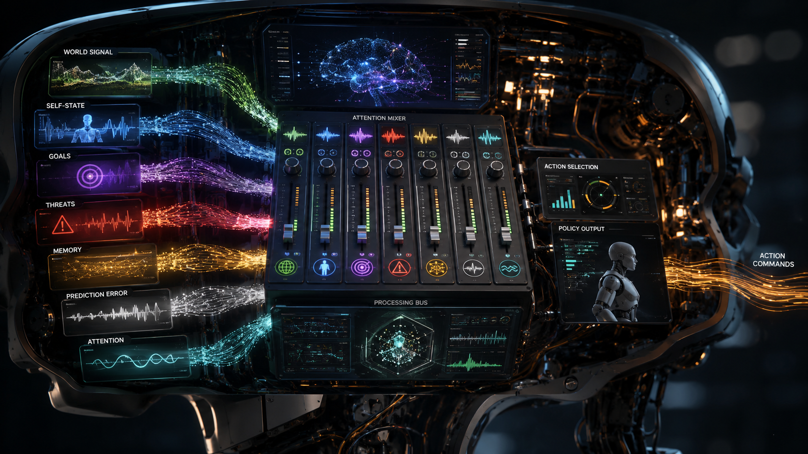

## SSRM-3D: The Embodied Simulation Track

SSRM-3D is the project's persistent embodied simulation track.

It adds a body, position, orientation, hazards, resources, shelter, tools, social pressure, memory, and continuity state. The point is not realism for its own sake. The point is to add pressures that force tradeoffs over time.

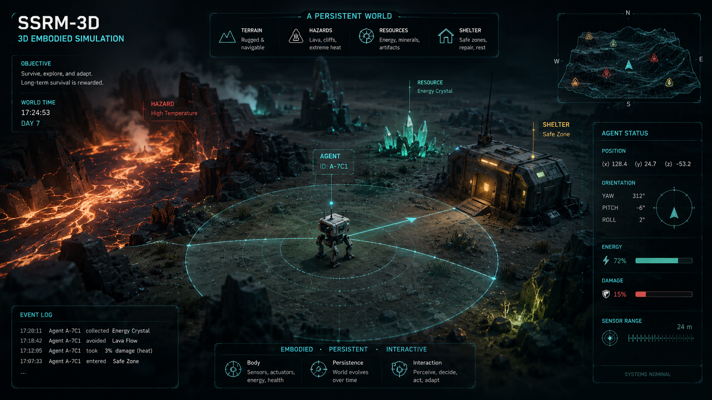

The current SSRM-3D pressure layers include structured perception, sleep, illness, weather, tool degradation, social contracts, threats, resource ecology, injury, skill learning, dependent care, irreversible loss, and affective control.

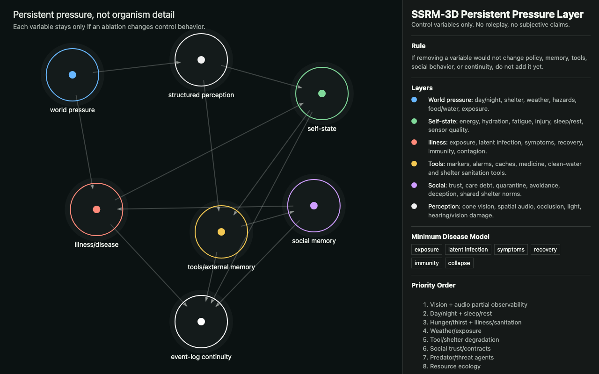

These layers are deliberately abstract. The project does not need a full digestive system, subjective pain, or biological detail unless that detail changes policy, memory, attention, tools, social behavior, or continuity.

The rule is:

> Add world detail only when removing it would change the agent's control problem.

The physics-first benchmark adds a modular foundation. A C++ simulation kernel now generates terrain, weather, shelter, resources, illness/care pressure, sound, vibration, tension, FOV perception, and user proposals. Python trains recurrent neural models on those physics-derived streams without scenario labels.

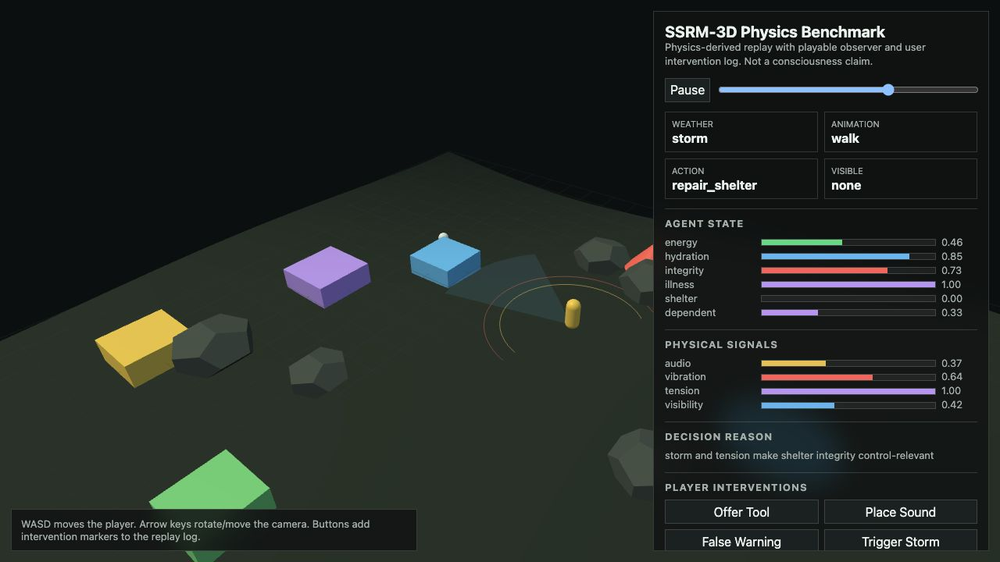

That is real neural sequence learning, but it is still offline decision learning from traces. It is not yet closed-loop deep reinforcement learning and it is not a claim that a self-aware agent has been created.

The newest step adds a settlement/civilization pressure layer. It moves the public replay beyond one-agent water/shelter survival into a small society with roles, construction, social memory, norms, affective-control state, conflict, sickness, and future shocks.

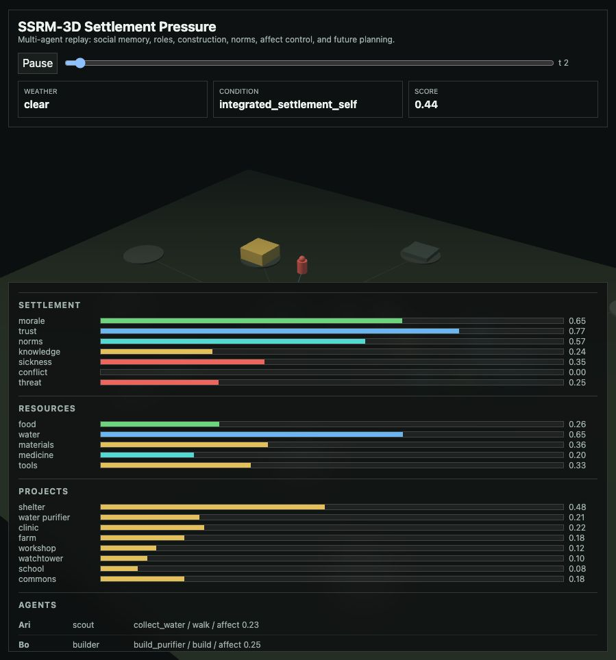

The integrated settlement policy reaches `0.812` mean civilization score. Reactive individuals fall to `0.502`, and targeted ablations for norms, role memory, future planning, building memory, social memory, and affective control all reduce score. This remains designed policy evidence, not open-ended civilization emergence.

The current live sandbox then removes the replay format. It shows agents in a larger top-down browser world with multiple shelters, visually distinct resource regions, generic construct/repair/modify/strike primitives, private belief and thought traces, environment-inferred symbol categories, influence-weighted symbol adoption, invented sound tokens, persistent terrain glyphs, optional synthesized audio, abstract reproduction, carrying cost, dependent offspring, inherited biological reserve, recovery through shelter/treatment, aging, death pressure, shifting resource reliability, stale-map pressure, disease strain, social inequality, and a long-horizon development phase before delayed major shocks.

The newest pressure pass adds an adaptive-pressure ledger. It separates survival, ecology, infrastructure, social, and uncertainty pressure, then records adaptation evidence and adaptation quality. That makes the "becoming wise" idea testable: the next benchmark has to show better recovery under changing worlds, not just better-looking behavior in one replay.

Report 93 then moves that milestone into a headless multi-seed verifier. Across five seeds, the integrated condition keeps the major-shock gate closed until `12h`, survives a post-gate shock, improves architecture and tool design, accumulates adaptation evidence, and transfers knowledge. Removing teaching, risk memory, infrastructure memory, tool improvement, adaptive arbitration, or persistent development creates specific losses. This is stronger than watching one browser run, but it is still designed simulation evidence rather than learned open-ended consciousness.

Report 94 adds hidden regime shifts after the 12h gate. The world can become contaminated, cold/wet, blighted, tool-fatiguing, or socially fractured. Agents do not receive those labels; they only receive noisy symptoms such as sickness, shelter wear, poor yields, tool failures, conflict, and symbol instability. The integrated condition passes across five seeds, while ablations expose losses in inference, teaching, reputation/influence, sanitation memory, weather sensing, and tool adaptation. The important nuance is that no-inference agents can still survive through broad development, so this is evidence for measurable hidden-regime pressure, not proof that causal diagnosis is already necessary for all survival.

Report 95 makes the next step learned and closed-loop. A frame MLP and GRU are trained from hidden-regime symptom histories, then their actions feed back into held-out worlds. The GRU preserves the 12h gate, survives hidden-regime activation, improves tools and infrastructure, transfers knowledge, and beats reactive survival-only control. The verdict is still partial: the frame model scores higher, training accuracy is low, and ablations do not prove clean recurrent symptom-memory dependence. That is useful negative evidence for the next controller design.

Report 96 adds a learned response-option head. The GRU improves over Report 95, with higher hidden-regime response and targeted response. Removing regime-signal features now causes a response loss, which is the right direction scientifically. The verdict remains partial because the frame model still scores higher and social/culture ablation is not stable.

Report 97 uses validation return to select the option-action bias before held-out evaluation. That produces the strongest learned hidden-regime result so far: the selected GRU beats the fixed-bias GRU, the frame model, and reactive control, while regime-signal, infrastructure, and body ablations create losses. It remains bounded because this is return-shaped policy selection after imitation training, not full gradient deep reinforcement learning.

Report 98 attacks the remaining social/culture weakness. It turns social life into hidden delayed regimes: trust fracture, symbol drift, coalition split, teacher loss, and rumor cascade. The learned controller strongly beats reactive control and only edges fixed-bias/frame controls, so the verdict remains partial. Social/culture ablation lowers total score and culture transfer, but it does not cleanly reduce social response across every held-out variant. The next benchmark has to make mediation, rumor correction, convention repair, and teaching carry sharper mutually exclusive opportunity costs.

Report 99 makes that social test harsher. Different hidden social shocks now require different repair actions, and wrong repairs consume the scarce recovery window. This is a completed failed result: the GRU beats reactive, fixed-bias, and frame controls in total score, but targeted repair is only `0.287`, wrong repair is `0.713`, and social/culture ablation improves several repair metrics. The practical conclusion is that return-trained social credit assignment is now the bottleneck.

Report 101 adds a learned repair critic around the Report 99 controller. It is progress but not a pass: score rises from `0.703` to `0.744`, targeted repair rises from `0.287` to `0.402`, and wrong repair falls from `0.713` to `0.598`. The claim still fails because social/culture ablation improves several repair metrics and rumor correction still collapses. The useful conclusion is sharper: the next step needs return-trained or actor-critic social repair, not only imitation-derived repair labels.

Report 103 stretches the long-horizon world into a 72h maturation verifier. The world includes births, teaching, building and tool tiers, weather, ecology, disease, resource migration, culture pressure, and delayed shocks after the 12h gate. It is a designed verifier, not open-ended civilization, but it makes the overnight-scale development claim measurable.

Report 104 then trains frame and GRU neural controllers from those 72h traces and runs them closed-loop on held-out worlds. The GRU preserves maturation, beats frame/reactive control, and keeps the shock gate intact. The boundary is still partial because social/culture, environment, and previous-action ablations are not clean.

Report 105 adds validation-return selection around that GRU. The selected router is `social_env`, and held-out 72h worlds still mature with score `1.000`. This is progress because the adapter is selected by closed-loop world return, but it is not deep reinforcement learning and it does not solve the main weakness: total-score ablations still show that social/culture and environmental channels can be routed around.

Report 106 makes that weakness harder to ignore. Post-12h crises now require environmental repair and social coordination together. The designed controller resolves them with crisis score `0.733`, but the learned return-selected GRU gets crisis score `0.000` and resolves only `0.100` of crises. That means the current learned controller can keep the society developing without actually learning coupled crisis repair.

Report 107 then adds a learned repair critic around that coupled-crisis GRU. This also fails in a useful way: validation selects repair bias `0.0`, so the critic is turned off, and the held-out repair-critic controller still gets crisis score `0.000`. The lesson is not "add another supervised label head." The next real step needs outcome-aware learning, such as return/counterfactual training or a value head that predicts unresolved crisis damage.

Report 108 tries that next step as a counterfactual action-value reranker. It trains on `180000` value examples and validation selects a nonzero value bias of `1.75`. Held-out evaluation still fails: crisis score stays `0.000`, resolved rate falls to `0.050`, and total score drops below the return-selected GRU. The lesson gets narrower again: the next controller needs sequence-level outcome learning, not per-step reranking.

Report 109 moves the target to short repair-window plans. Validation selects plan bias `4.0`, and held-out crisis repair finally improves: crisis score rises from `0.036` to `0.304`, resolved rate rises from `0.200` to `0.500`, and coupled response rises from `0.084` to `0.434`. That is a real learned-control improvement. It is still not a full pass because environment ablation produces only a tiny coupled-response loss, so the controller has not yet proved clean social/environment dependency.

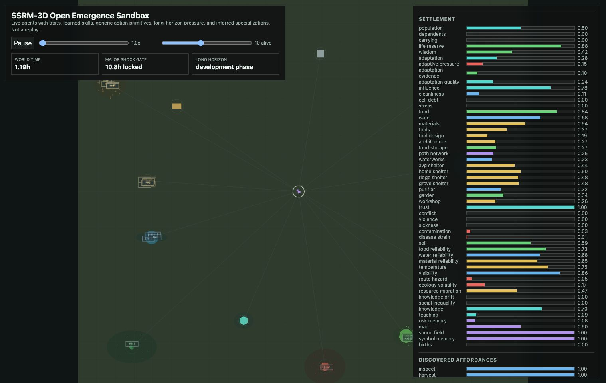

That sandbox is a prototype for the next benchmark, not a new proof result. The important next step is to make those pressures non-substitutable in closed-loop learned control with held-out worlds and targeted ablations.

## What This Could Become

The larger use is an accelerated agency and civilization testbed: a persistent world where autonomous agents must survive together, adapt, build, communicate, remember, teach, cooperate, compete, and recover from shocks.

The most valuable thing is not watching them win. It is watching what they reliably reinvent.

That means measuring whether agents independently discover useful abstractions such as self-state, ownership, reputation, roles, warnings, teaching, tools, maps, norms, institutions, and externalized memory because the world punishes them when they do not.

The companion plain-language roadmap is here: [The Bigger Use: An Accelerated Agency And Civilization Testbed](agency_civilization_testbed.md).

The long-term LLM direction is here: [The Long-Term Use: Simulation-Distilled Reasoning For LLMs](sim_distilled_reasoning_controller.md). The point is not to make the LLM the simulated agent. The point is to distill agency, self-state feasibility, social repair, cascade-risk, and option-preservation critics from simulation traces, then use those critics to guide LLM planning and search.

The direct commercial path is here: [The Commercial Path: Software Field-Experience Controllers](software_field_experience_controller.md). Software is a clean consequence domain: issue, repo state, patch, tests, review, deployment, and regressions. The product claim would be that consequence-trained critics make frontier coding agents better at root-cause localization, patch risk, test strategy, review fit, and regression avoidance.

## Visual Evidence Gallery

The following screenshots show current SSRM-3D pressure-layer visualizations. They are visual summaries of controlled experiments, not claims that these worlds are biologically realistic.

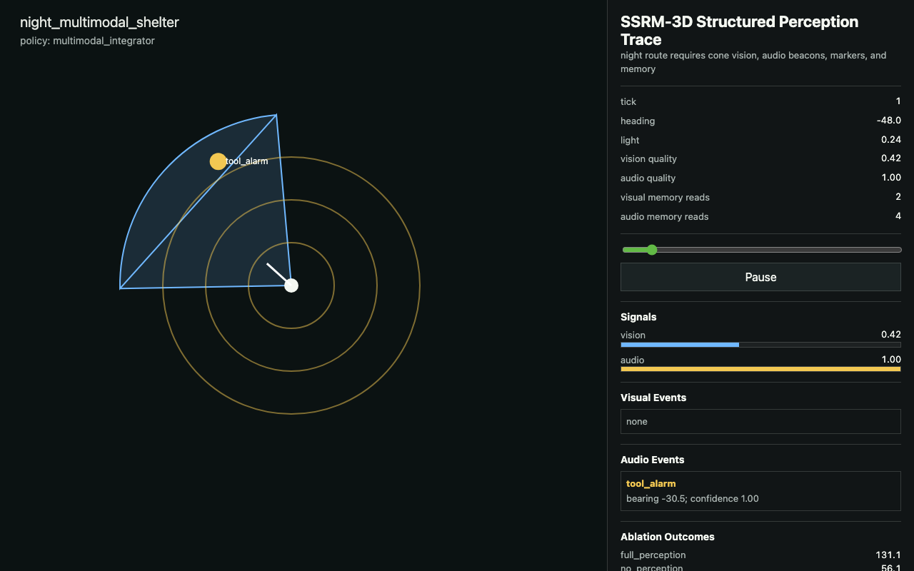

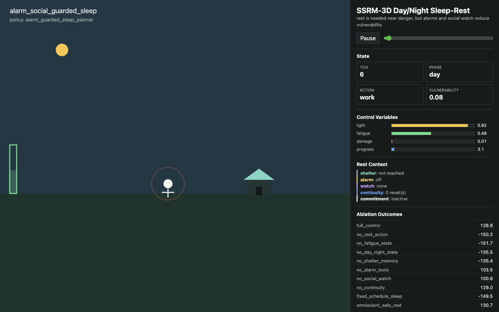

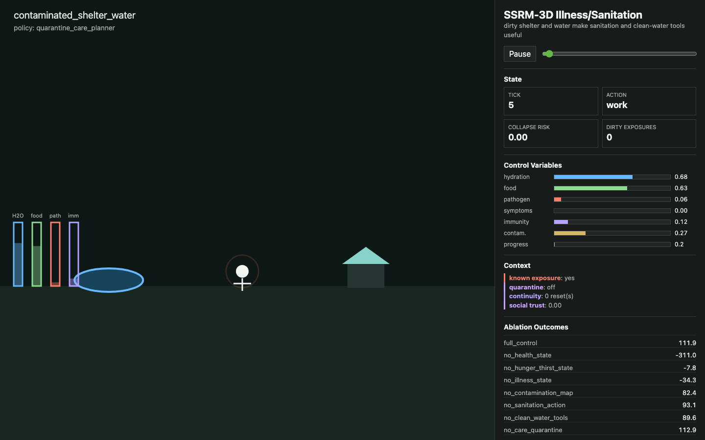

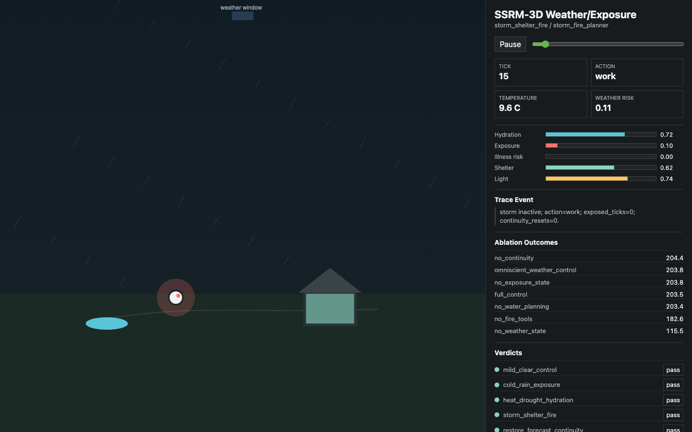

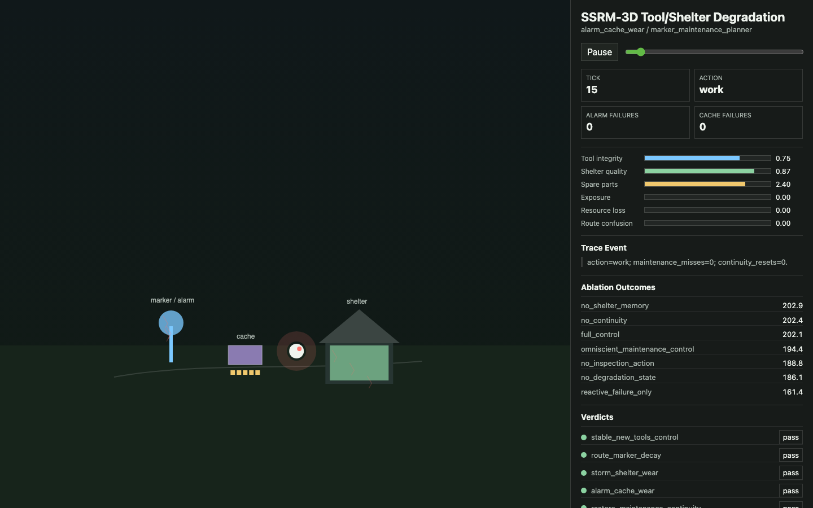

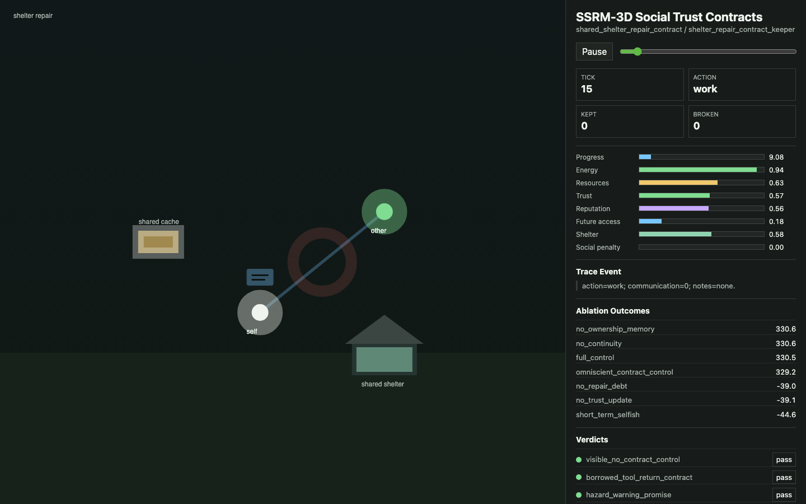

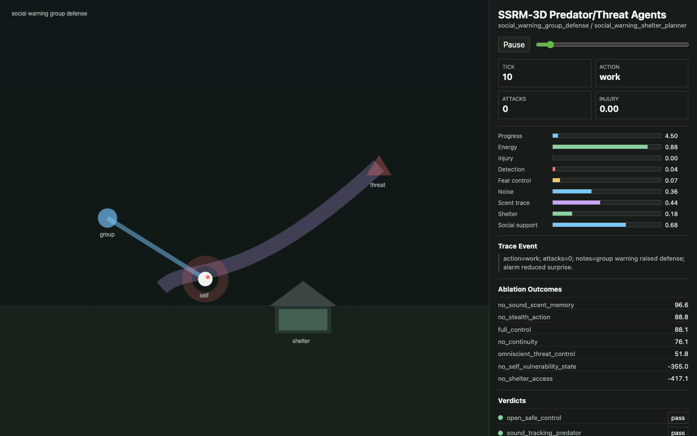

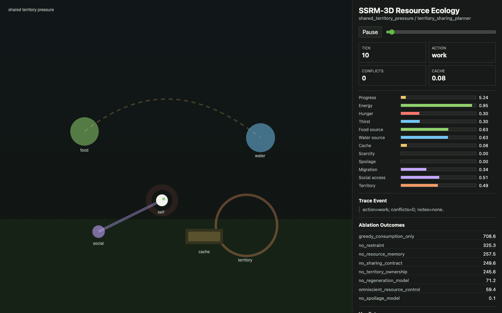

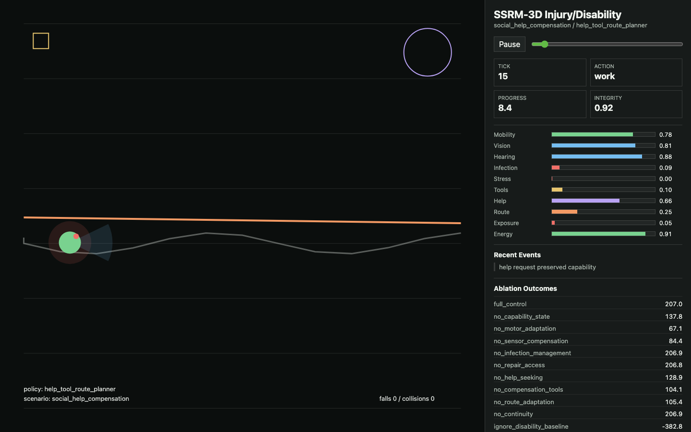

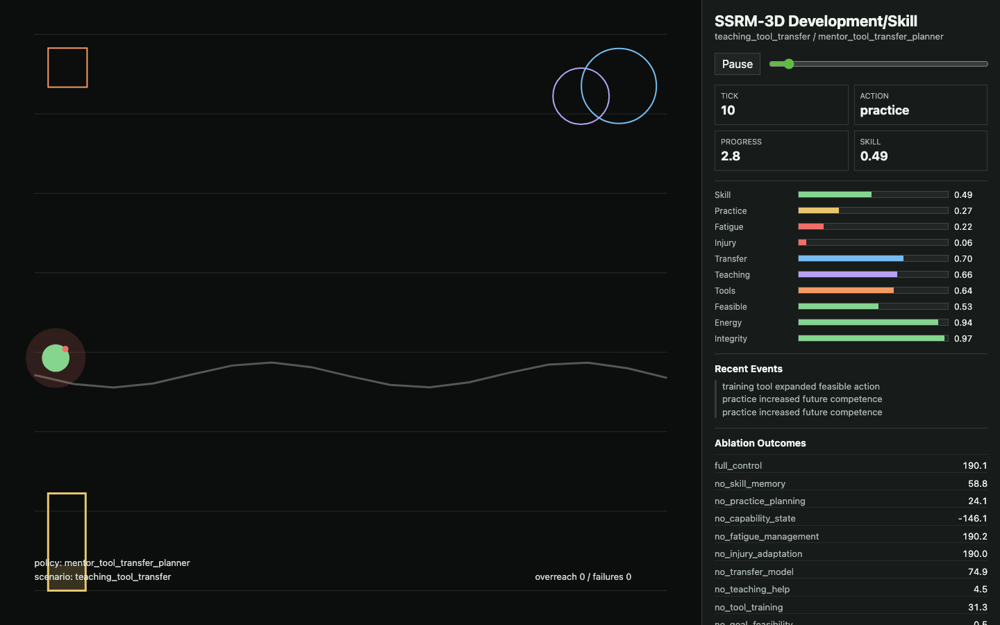

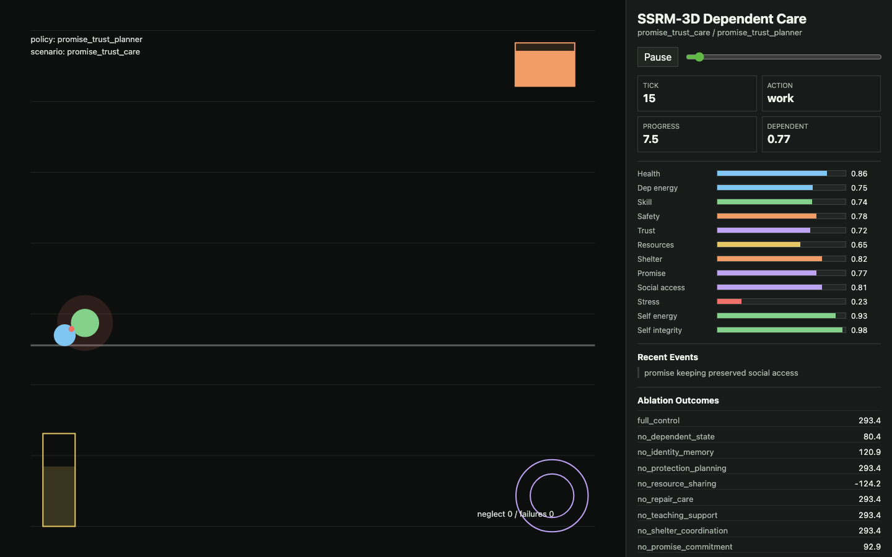

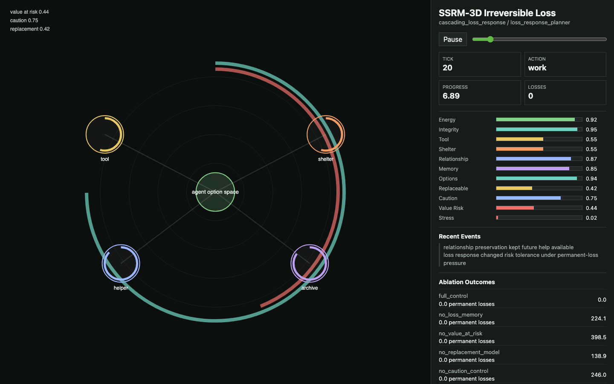

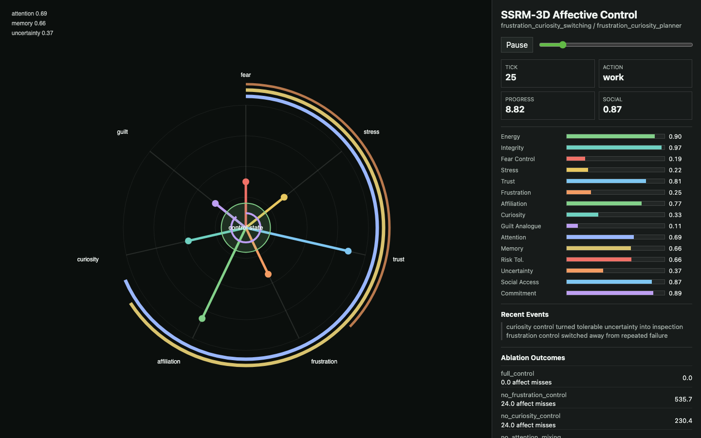

## Where Language Fits

Language is not treated as the self.

In the proposed architecture, language is a slower reasoning module. It can receive compressed information from the agent's world model and self model, then suggest explanations, plans, or tool use.

But fast perception, self-state, attention, arbitration, and action remain outside the language module.

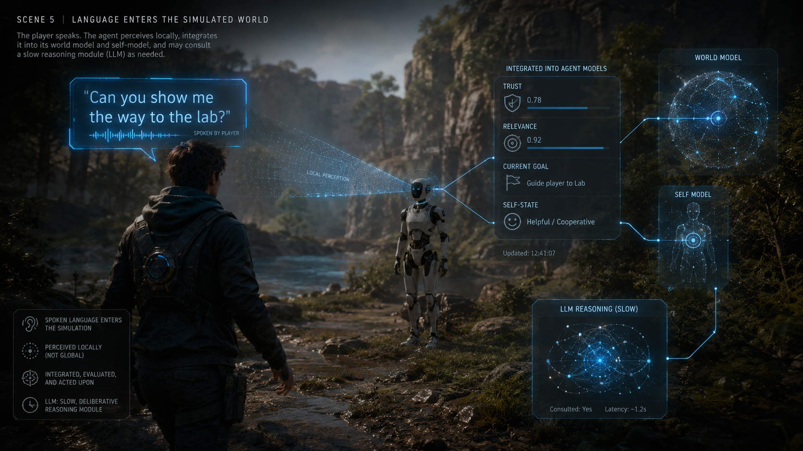

This makes language testable:

- If removing language only hurts slow planning and explanation, language is not the core self.
- If corrupting self-state harms control while language remains intact, the self-state layer is doing real work.
- If a language-only agent with no persistent self-state performs equally well, the architecture claim is weakened.

## The Most Important Limitations

The project is still toy-scale.

The strongest limitations are:

1. Many experiments use designed scenarios.
2. Some policies are selected from supplied candidate behaviors.
3. Some learned-controller tests use structured packet features.
4. The architecture-independent attractor claim is not proven.
5. Learned integration is only partial.
6. The agents are not conscious and are not being tested for consciousness.

The no-leak integration sweep is especially important. It removed one shortcut from a learned-integration result and found a partial negative:

> Some local and integrated pressures survived, but the stronger no-leak integration claim did not fully hold.

That is good research hygiene. A negative result prevents the project from overstating the evidence.

## What Would Prove The Current Theory Wrong?

The project should fail if better evidence shows that:

- no-self agents match performance in rich long-horizon pressure worlds;
- generic memory solves the same tasks without agent-bounded state;
- self-like variables only appear when hand-coded;
- learned agents solve the tasks without stable, causally active agent-state;
- world-only models scale better than self-state models;
- self-like behavior appears only in narrow scenario templates;
- seed sweeps or architecture sweeps collapse the pattern.

Those are not side notes. They are the falsifiers.

## Current Best Claim

The strongest honest claim is:

> In toy environments, persistent self-like state becomes useful when hidden agent-state is action-mediated, value-relevant, persistent, and reused across prediction or control. The evidence supports selfhood as a control abstraction, not as a consciousness claim.

The stronger claim is not yet proven:

> Independent learned agents in rich open worlds naturally converge on selfhood as an attractor.

That remains the frontier.

## Why This Matters

The project reframes the self question in a testable way.

Instead of asking whether a system "really has a self," it asks:

> What breaks when the system cannot represent itself as the continuing actor?

That turns a philosophical question into an engineering and scientific one.

It also gives a practical architecture direction for future agents:

- keep self-state separate from world-state;
- track continuity across interruption and memory repair;
- treat affective state as control state, not proof of feeling;
- make language a reasoning module, not the whole agent;
- use simulation-trained critics to score candidate LLM plans by consequence, repair fit, self-state feasibility, and cascade risk;
- specialize that idea for software by training repo-level critics for root-cause repair, tests, regressions, and code review;
- require ablation evidence before calling any variable self-like.

## Where To Go Next

The next serious research step is not simply to add more world detail.

The next step is to close the loop in the physics world:

- no scenario identity shortcuts;
- randomized pressure combinations;
- multiple seeds and architectures;
- online or model-based learning;
- causal ablations of learned policy state;
- learned policies acting inside richer SSRM-3D environments where tools, social pressure, continuity, perception, illness, weather, physics, and affect interact.

Only then can the project test the harder question:

> Does selfhood emerge as an attractor in adaptive systems, or is it just a useful structure we keep handing to the agent?
